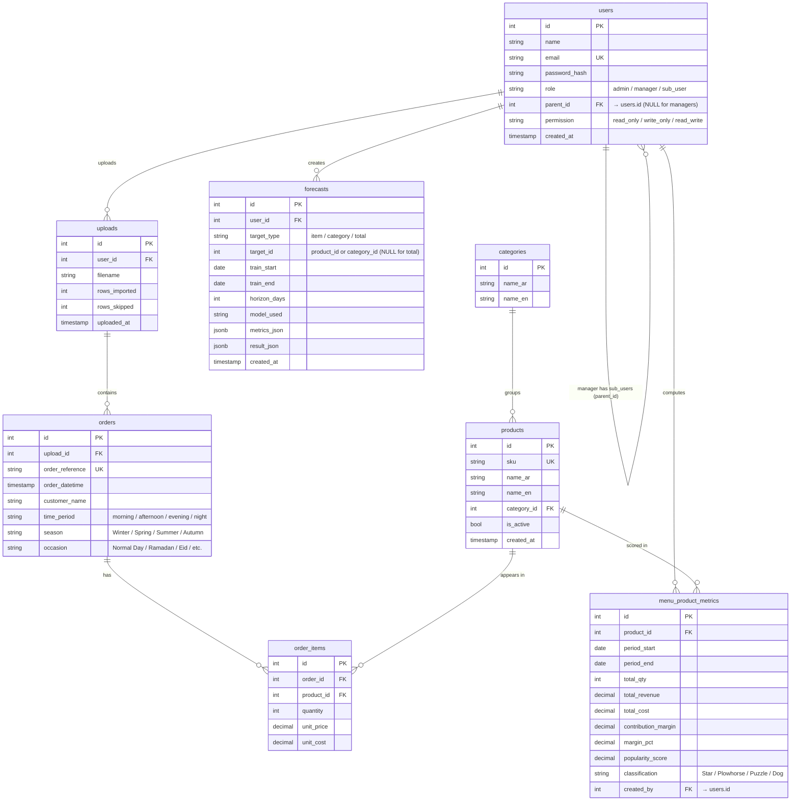

# Database Schema — Smart Sales Analytics & Forecasting System

PostgreSQL 8-table schema based on the supervisor's ERD, extended with sub-user
support and the `time_period`/`season`/`occasion` columns the forecasting model
needs.

## Entity-Relationship Diagram



## Tables in Plain English

### 1. `users` — accounts
- A row is either a **manager** (root account) or a **sub_user** (created by a manager).
- A sub-user has `parent_id` pointing to its manager.
- A sub-user has a `permission` level: `read_only`, `write_only`, or `read_write`.
- Managers have NULL `parent_id` and NULL `permission` (full access).

### 2. `uploads` — file ingestion log
- Every successful `/api/upload` call inserts one row here.
- Records the filename, who uploaded it, and how many rows were processed.
- `ON DELETE CASCADE` from `users` — deleting a user removes their upload history (and the orders that came from those uploads).

### 3. `categories` — bilingual menu categories
- Each category has Arabic and English names.
- Created automatically when a new category appears in an uploaded file.

### 4. `products` — bilingual menu items
- `sku` is the natural unique key (used to dedupe across uploads).
- Linked to one category via `category_id`.
- `is_active` lets the system hide discontinued items without deleting them.

### 5. `orders` — customer orders (one row per receipt)
- `order_reference` is the POS receipt number (unique).
- `time_period` / `season` / `occasion` are stored at order level because they apply to the whole order, not per item.
- Linked to the upload that brought it in.

### 6. `order_items` — line items inside an order
- `quantity` × `unit_price` = revenue contribution.
- `quantity` × `unit_cost` = cost contribution.
- This is the fact table used by Dashboard, Menu Engineering, and Forecasting.

### 7. `forecasts` — cached forecast results
- One row per forecast run (item, category, or total scope).
- `metrics_json` stores MAE, error %, sample counts.
- `result_json` stores the full prediction payload (returned directly to the API caller on cache hits).
- Allows historical comparison: "what did we predict last week vs what happened?"

### 8. `menu_product_metrics` — Boston Matrix snapshots
- One row per product per analysis period.
- Stores the computed popularity, margin, and classification (Star / Plowhorse / Puzzle / Dog).
- `created_by` records which user ran the analysis.

## Relationship Cardinality

| Parent | Child | Relationship |
|---|---|---|
| `users` | `users` (sub-users) | One manager → many sub-users |
| `users` | `uploads` | One user → many uploads |
| `users` | `forecasts` | One user → many forecasts |
| `users` | `menu_product_metrics` | One user → many metric snapshots |
| `uploads` | `orders` | One upload → many orders |
| `orders` | `order_items` | One order → many line items |
| `categories` | `products` | One category → many products |
| `products` | `order_items` | One product → appears in many line items |
| `products` | `menu_product_metrics` | One product → many metric snapshots over time |

## ON DELETE Behaviour

All foreign keys use `ON DELETE CASCADE`. Practical implications:
- Delete a user → deletes their uploads, forecasts, metrics. The orders that came from those uploads also disappear.
- Delete a category → deletes every product in it (and all line items, and metrics).
- Delete a product → deletes every line item of that product (and its metric snapshots).
- Delete an upload → deletes all orders from that file (and their line items).

This is intentional: it keeps the database consistent without orphan rows, but
it's destructive. **Don't `DELETE FROM categories` unless you mean it.**

## Indexes

Performance indexes are created for every foreign-key column that the API
queries on (uploads.user_id, products.category_id, orders.upload_id,
order_items.order_id, order_items.product_id, forecasts.user_id,
menu_product_metrics.product_id, users.parent_id) plus `orders.order_datetime`
for date-range queries from the dashboard.

## Migration Notes

If you have an older local copy of this database (without `time_period`,
`season`, `occasion` columns on `orders`, or without sub-user fields on
`users`), recreate the schema:

```bash
psql gp_restaurant -c "DROP TABLE IF EXISTS menu_product_metrics, forecasts, order_items, orders, products, categories, uploads, users CASCADE;"
psql gp_restaurant < backend/schema.sql
psql gp_restaurant -c "INSERT INTO users (name, email, password_hash) VALUES ('Demo Manager', 'demo@psau.sa', 'placeholder');"
```

Then re-upload your data via the `/api/upload` endpoint.
