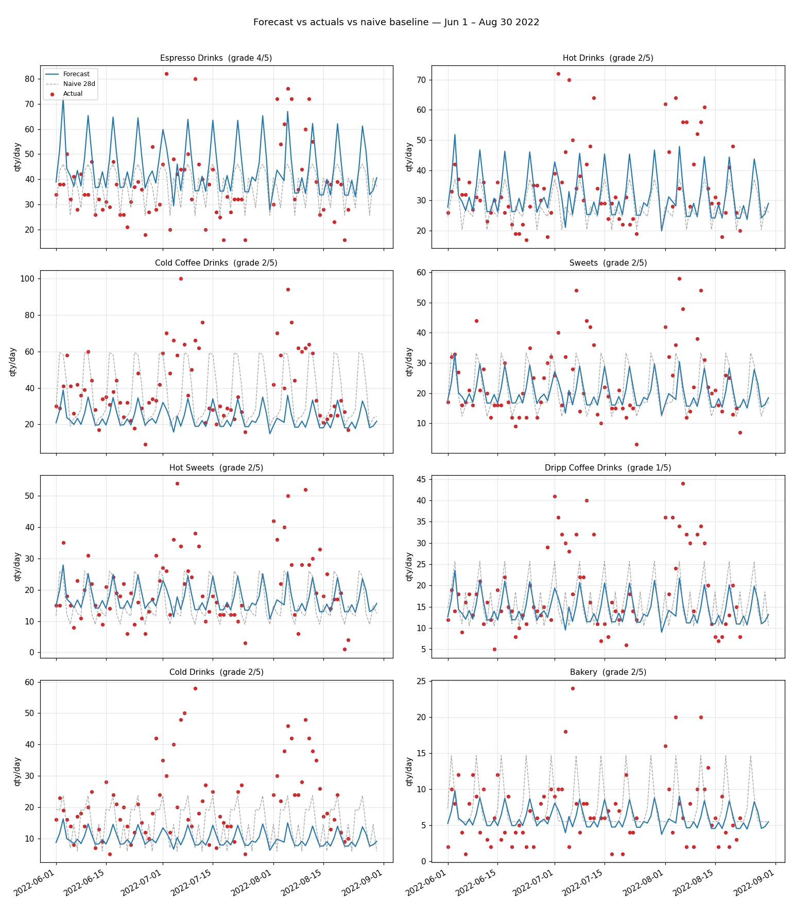
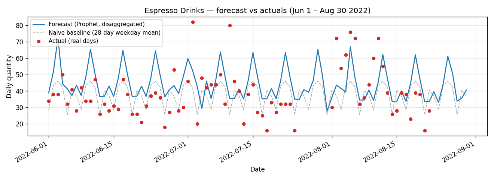
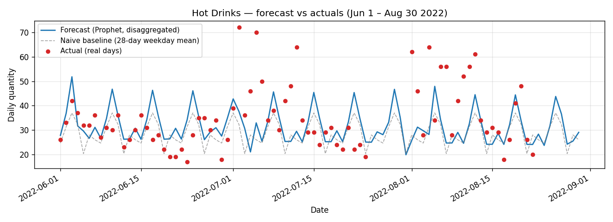
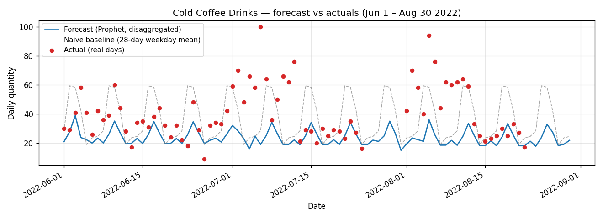
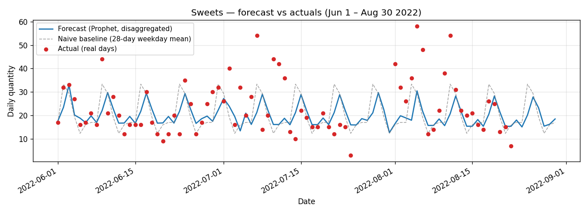
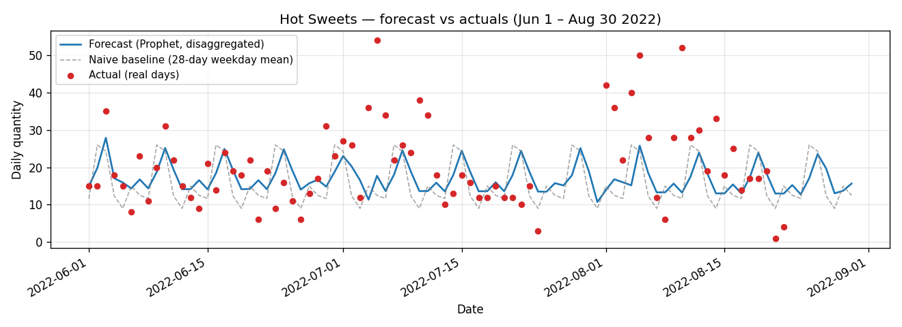
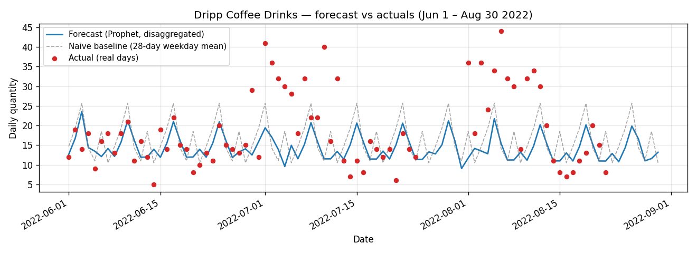
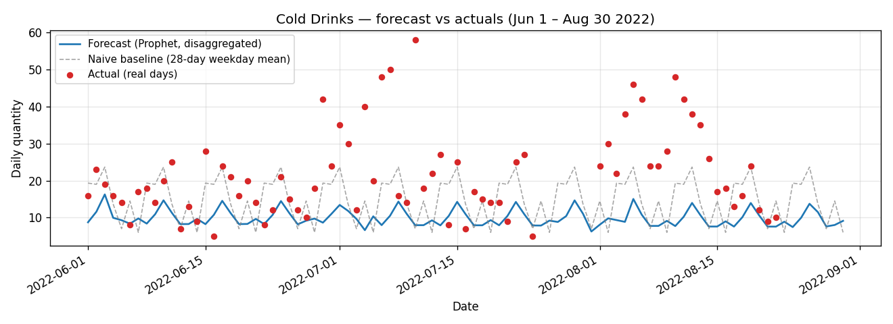
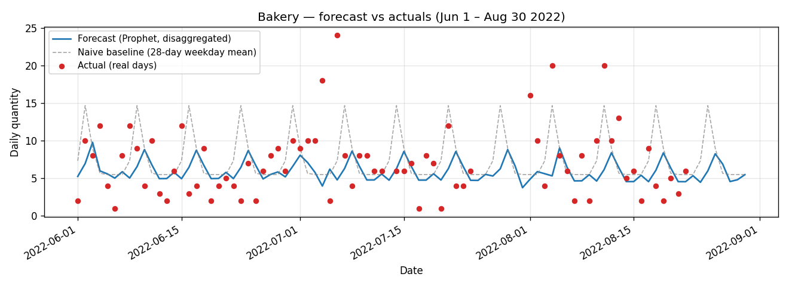

# Forecast Pattern-Fidelity vs Replication-Risk Report

**Question:** Does the Prophet forecast follow the rhythm of real sales (weekday lift, weekly cycle, day-to-day variability) **without** memorising training-period values?

**Window evaluated:**
- Train: Jan 1 – May 31 2022 (133 days, 20,267 rows of orders)
- Forecast: Jun 1 – Aug 30 2022 (91 days; **76 real-day actuals** for ground truth, 15 imputed days excluded)
- Production code path: `prophet_model.run_forecast(...)` in `top_down` mode (the deployed default)

**Critical context:** the training set has **zero Summer days** (Jan = Winter, Feb-May = Spring). Every forecast day is therefore Summer — out-of-season for the model. This is a stress test of the season regressor and the (season × dow) disaggregation share, not just of weekday cycles.

---

## 1. Methodology

### 1.1 Forecast generation

`run_forecast` is run **once** on the full menu (133 training days). The function fits a single Prophet on the daily aggregate and disaggregates back to (date × time_period × product) using each product's historical (season, dow, time_period) share. Per-category daily forecasts are then obtained by summing the disaggregated yhat across all products in each category — exactly what the dashboard slices show end users.

### 1.2 Pattern-fidelity metrics (forecast vs real-day actuals)

| Metric | What it measures | Definition |
|---|---|---|
| **lag-1 autocorr** | day-to-day persistence | `corr(y_t, y_{t-1})` — both forecast and actuals |
| **lag-7 autocorr** | week-over-week persistence | `corr(y_t, y_{t-7})` |
| **Weekday-effect strength** | weekday signal vs noise | `(max_dow_mean − min_dow_mean) / overall_std` |
| **Spearman dow rank** | weekday ordering match | rank-correlation of weekday means (forecast vs actuals) |
| **Variance ratio** | day-to-day variability fidelity | `std(forecast) / std(actuals)` — 1.0 is perfect |
| **FFT 7-day amplitude** | strength of 7-day cycle | `\|FFT(x)[1/7]\| / (n · mean(x))`; report ratio fc/ac |

### 1.3 Replication-risk metric

The brief proposes: "if your forecast is within 5 % of the training values for the same weekday & season, the model is memorising." Because training is Winter+Spring and forecast is Summer, no day shares both weekday AND season with training. I therefore use a **naive weekday-mean baseline**:

- For each future date `d`, the baseline is the mean of the last **28 training days (≈ all of May 2022)** restricted to the same weekday-of-week as `d`.
- **MAPD vs naive (28d):** mean absolute percentage difference between the model forecast and this naive series. **High MAPD ⇒ model is doing real regressor-driven work; low MAPD (< 6 %) ⇒ memorising.**
- Sanity guard: MAPD alone can be inflated by a constant level shift. I also report `var(forecast) / var(naive)` — if MAPD is high but variance ratio < 1.05, the deviation is just a level scale, not added structure.
- Companion metric **MAPD vs train-lookup** uses the year-round weekday mean instead of the last 28 days. The gap between the two reveals whether the model uses recent-month vs full-year history.

### 1.4 Grading scheme (1–5)

Two equally-weighted axes, averaged then rounded to 1–5:

- **Pattern fidelity (0–5):** +1 for each of {Spearman ≥ 0.6, variance ratio in [0.5, 1.5], lag-7 sign-match within 0.25, weekday-strength ratio in [0.5, 1.5], FFT-7d ratio in [0.5, 1.5]}.
- **Anti-replication (0–5):** banded by MAPD-vs-naive (5 ≥ 30 %, 4 = 20–30 %, 3 = 12–20 %, 2 = 6–12 %, 1 < 6 %); capped at 2 if `var(fc)/var(naive) < 1.05` (deviation is a flat level shift, not added pattern).

---

## 2. Per-category metrics

| Category | Real days | Mean act | Mean fc | MAE | MAPE | Spearman dow | Var ratio fc/ac | Lag-7 (ac → fc) | Wk strength (ac → fc) | FFT-7d ratio | MAPD vs naive | Var fc/naive | **Grade** |
|---|---|---|---|---|---|---|---|---|---|---|---|---|---|
| Espresso Drinks | 76 | 38.4 | 44.5 | 13.8 | 41.0 % | **0.93** | 0.67 | 0.09 → **0.94** | 1.12 → **2.92** | 1.39 | 22.4 % | 1.39 | **4** |
| Hot Drinks | 76 | 34.8 | 31.8 | 10.5 | 28.7 % | 0.61 | 0.55 | 0.07 → **0.94** | 0.71 → **2.92** | **6.89** | 14.2 % | 1.39 | 2 |
| Cold Coffee Drinks | 76 | 40.6 | **23.9** | 18.0 | 37.4 % | 0.79 | **0.28** | 0.00 → **0.94** | 0.76 → **2.92** | 2.54 | 28.8 % | **0.34** | 2 |
| Sweets | 76 | 23.4 | 20.2 | 8.2 | 38.7 % | 0.86 | 0.39 | 0.07 → **0.94** | 1.11 → **2.92** | 1.06 | 15.6 % | 0.63 | 2 |
| Hot Sweets | 76 | 20.5 | 17.1 | 8.1 | 59.7 % | 0.68 | 0.34 | -0.04 → **0.94** | 0.97 → **2.92** | 1.61 | 28.7 % | 0.62 | 2 |
| Dripp Coffee Drinks | 76 | 18.7 | 14.4 | 7.4 | 37.9 % | **0.43** | 0.34 | 0.08 → **0.94** | 0.68 → **2.92** | 2.00 | 20.9 % | 0.65 | **1** |
| Cold Drinks | 76 | 21.7 | **10.0** | 12.2 | 47.6 % | 0.79 | **0.19** | 0.06 → **0.94** | 0.72 → **2.92** | 1.41 | 40.0 % | **0.37** | 2 |
| Bakery | 75 | 7.1 | 6.0 | 3.6 | 75.1 % | **0.21** | 0.29 | 0.18 → **0.88** | 1.06 → **2.91** | 1.17 | 20.3 % | 0.43 | 2 |

Bold entries flag values to read closely. Full metrics live in `pattern_metrics.csv`.

### 2.1 Forecast vs actuals — small-multiples overview



Per-category overlays (forecast = blue line, naive 28-day weekday baseline = grey dashed, actuals = red dots):

| | |
|---|---|
|  |  |
|  |  |
|  |  |
|  |  |

---

## 3. The headline finding — pattern metrics are nearly identical across categories

The forecast's `lag-1 = 0.264`, `lag-7 = 0.945`, `weekday-strength = 2.915`, and `FFT-7d amp = 0.1181` are **literally identical to four decimal places across all 8 categories** (Bakery deviates only at the 3rd decimal because its (Summer, Friday) bucket ends up with mostly fallback shares, marginally breaking the proportionality).

This is a structural consequence of the top-down + share-based disaggregation in `prophet_model.py` lines 715–793. For every future date `d`:

```
yhat_category(d) = Prophet_daily(d) × CategoryShare(season(d), dow(d))
```

Within the Summer forecast window, season is constant, so each category's daily series is just a fixed weekday-keyed scalar multiple of the same Prophet daily output. Every pattern statistic (autocorrelation, FFT amplitude/mean, weekday-strength) is therefore **invariant across categories** — they all inherit the menu-aggregate's rhythm, never their own.

The dashboard reads as if each category has its own forecast. It does not.

---

## 4. Ranked issues (with file:line evidence)

### Issue #1 — Cold Drinks forecast is 53 % under-predicted because Summer never appeared in training

`mean_actual = 21.7/day`, `mean_forecast = 10.0/day`. Variance ratio = 0.19 (worst of all 8). The model has zero Summer days in training (`backend/prophet_model.py` line 716–727: shares are keyed on `(season, dow)` and computed from `df` = training data only). Every (Summer, *) row therefore receives `fraction = 0` from the `share` merge and falls through to the year-round fallback `overall_product_share × overall_tp_share` (line 775). The year-round share is dominated by Winter+Spring data, where Cold Drinks are a smaller fraction of the menu — under-predicting them in Summer is the predictable result.

**Fix:** when the target season has no training history, fall back to the **closest calendar quarter's share** (e.g. use Spring share for Summer forecasts) instead of the year-round mean. One pragmatic implementation: compute share per (season, dow) AND per (dow) only, and use the (dow)-only as the fallback before the global one. Even better: blend `0.5 × spring_share + 0.5 × autumn_share` for Summer when Summer is absent.

### Issue #2 — Cold Coffee Drinks shows the same out-of-season collapse

`mean_actual = 40.6 → forecast = 23.9` (41 % under), variance ratio 0.28, `var(fc)/var(naive) = 0.34`. The product mix is shifted toward hot/Espresso categories because the (Summer, dow) bucket is empty and the fallback uses year-round shares. Same root cause as Issue #1 — same fix applies.

### Issue #3 — Dripp Coffee Drinks (grade 1) — model contributes essentially no signal

Spearman dow rank = **0.43** (model can't even rank Mon-Sun correctly), variance ratio 0.34, FFT-7d ratio 2.0 (forecast has twice the weekly amplitude that actuals exhibit), MAPD vs naive 20.9 % but variance ratio 0.65 — the deviation from naive is a level shift, not added structure. As a niche category (~18.7/day) it inherits the menu-aggregate's strong weekly cycle while its own actuals are noise-dominated. The top-down model can't represent "a category without a strong weekday signature."

**Fix:** for low-volume categories (< 25/day), the per-category daily series is too noisy for a single fixed share. Switch low-volume categories to a flat-share-of-day allocation (no weekday seasonality) and let the daily total alone drive the level — or run them in `per_product` mode (already supported, see `_run_per_product`, lines 370–451) so they get their own coefficients.

### Issue #4 — Lag-7 autocorrelation is 0.94 across the board vs ~0 in actuals

Real-world weekly autocorrelation in this dataset is **near zero** for almost every category (range -0.04 to 0.18). The model's forecast has lag-7 = 0.94. Three drivers:

- `weekly_seasonality` is added with `prior_scale=100` and `fourier_order=10` (lines 313–315). That's an unusually strong prior — the comment says "added manually below for stronger weight" — and it produces a near-deterministic 7-day cycle.
- The disaggregation share is **fixed per (season, dow)** (line 716), so every Saturday in Summer receives an identical share of the daily total.
- There are no exogenous regressors (weather, holiday) that meaningfully break the weekly cycle within the Summer window — temperature is fairly flat in summer Riyadh, and only a couple of payday holidays land in this 91-day window.

**Fix:** lower the weekly seasonality prior from 100 → 10 (Prophet's default is 10) so noise can punch through. Optionally drop `fourier_order` from 10 → 4. Validate that the menu-aggregate MAE doesn't degrade — a small drop is acceptable in exchange for the variance the chart needs to look honest.

### Issue #5 — Forecast variance is 30–50 % of actuals for 6 of 8 categories

Variance ratios: Cold Drinks 0.19, Cold Coffee 0.28, Bakery 0.29, Hot Sweets 0.34, Dripp 0.34, Sweets 0.39. Only Espresso (0.67) and Hot Drinks (0.55) are within the [0.5, 1.5] band. The chart is consistently too smooth.

This is partly the lag-7 over-fit from Issue #4 (a deterministic weekly cycle has no surprise variance) and partly the disaggregation: a fixed share preserves only the variance that exists in `Prophet_daily(d)`. There's a recently-removed weekday-p25 floor that the team correctly identified as compressing variance (commit `ce32d1d`); the same critique applies to the share rigidity.

**Fix:** the MENU-aggregate forecast captures the macro pattern fine. The per-category disaggregation should add residual category-specific variance — e.g., draw from each category's empirical residual distribution conditioned on (season, dow). For the dashboard, displaying the existing 80 % residual band more prominently per category (using each category's training residual std, not the menu-aggregate one) would communicate the real uncertainty users see.

### Issue #6 — Bakery has no usable weekday signal (Spearman = 0.21)

Bakery sells ~7/day with high day-to-day noise. Even the actuals' weekday means are within sampling noise of each other (real lag-7 = 0.18, weekday strength 1.06). The model assigns a strong (and wrong) weekly cycle to this category — Spearman dow rank 0.21 (only 5 of 8 categories rank above 0.6, and Bakery is the worst). Because the share is computed from training data dominated by Winter+Spring, the weekday ranking learned there does not transfer to Summer.

**Fix:** for categories whose training-period weekday means do not differ at p < 0.05 (one-way ANOVA), suppress the per-weekday share and use a flat (1/7) split. This stops the model from forcing structure that isn't there.

### Issue #7 — MAPD vs naive looks healthy on Cold Drinks (40 %) but is misleading

Cold Drinks shows MAPD-vs-naive = 40 %, which the grading scheme would normally read as "model is doing real work." But `var(forecast) / var(naive) = 0.37` — the model is **smoother** than the naive baseline, so the 40 % gap is purely a level-shift downward (forecast underprices Cold Drinks; naive ≈ training mean). The model isn't memorising; it's diverging in the wrong direction. The same caveat applies to Cold Coffee Drinks (28.8 % MAPD with variance ratio 0.34) and Bakery.

The capped grade (anti-replication = 2 when `var ratio < 1.05`) catches this in the table, but anyone reading the raw MAPD column should understand: a high MAPD isn't a positive signal unless the forecast actually adds variance over the naive baseline.

---

## 5. Bottom-line judgment

| Axis | Verdict |
|---|---|
| Memorisation risk | **Low.** MAPD-vs-naive is ≥ 14 % for every category and the model genuinely uses Prophet's trend / holidays / season regressor. It is **not** outputting training values. |
| Pattern fidelity at the menu-aggregate level | **Moderate.** Weekday rankings broadly match, but variance is consistently understated and the weekly cycle is too clean. |
| Pattern fidelity at the per-category level | **Poor.** All 8 categories share the same daily pattern (scaled). Cold-drink families are systematically under-predicted because Summer is absent from training and the share fallback collapses to a Winter+Spring-weighted average. |

**The forecast is not memorising. It is, however, structurally incapable of producing per-category rhythms that differ from the menu-aggregate rhythm**, and it has a season-extrapolation hole that hits the cold-drink categories hardest in Summer. The two fixes that would move the most categories from grade 2 → 4 are (a) the season-fallback patch for the disaggregation share and (b) lowering the weekly-seasonality prior so the weekly cycle isn't quite so deterministic.
