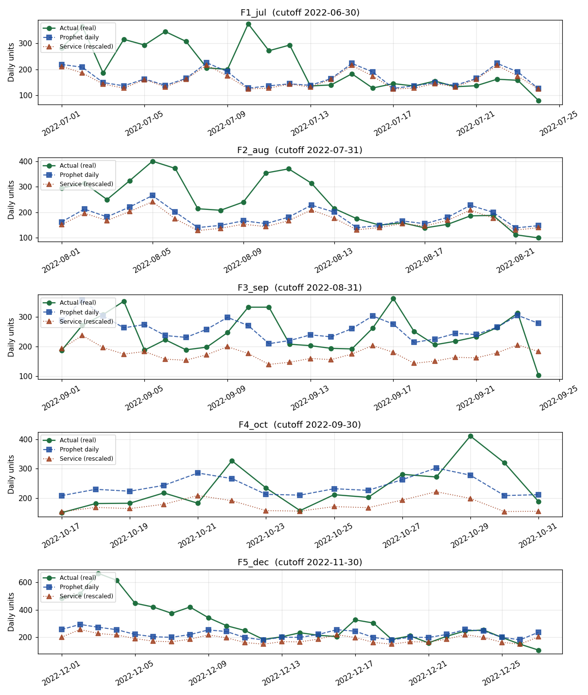
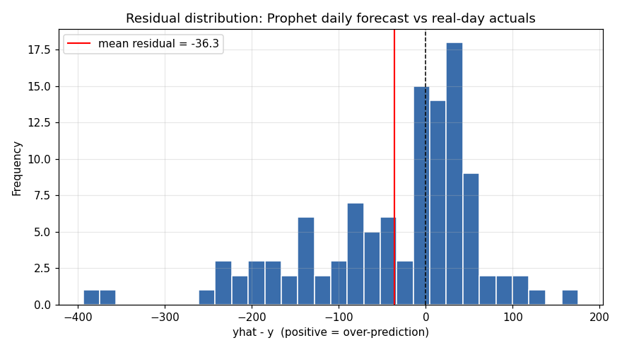
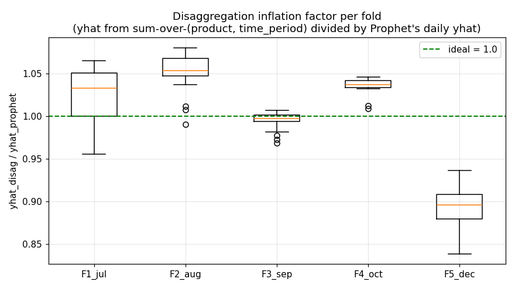
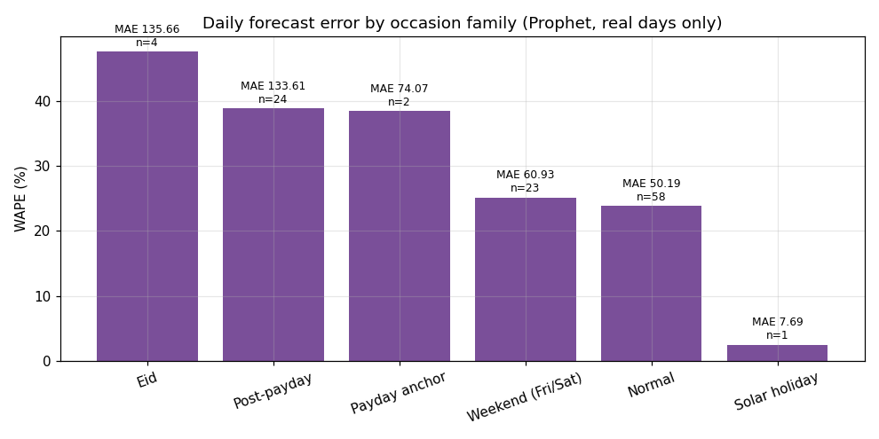
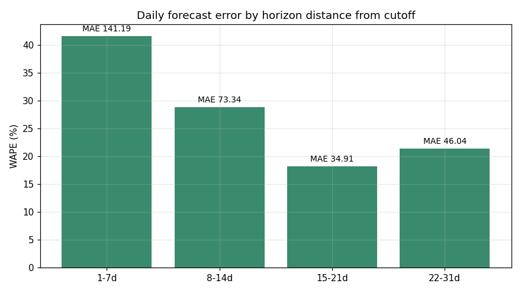
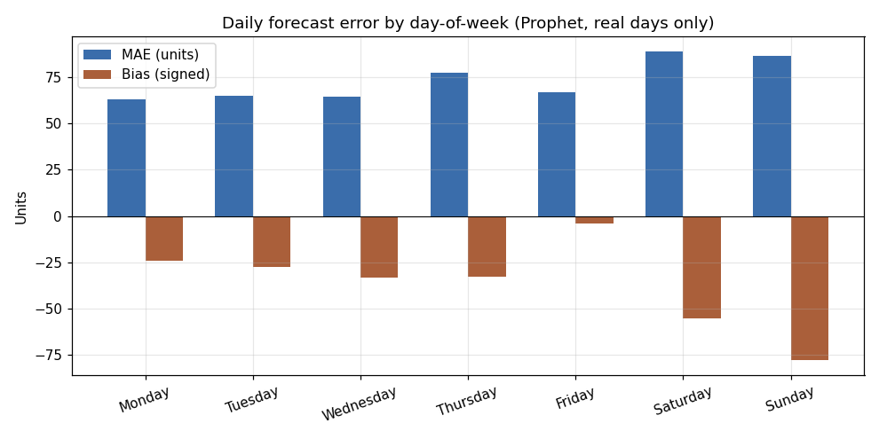
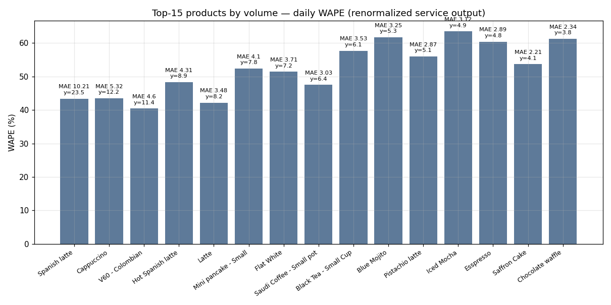
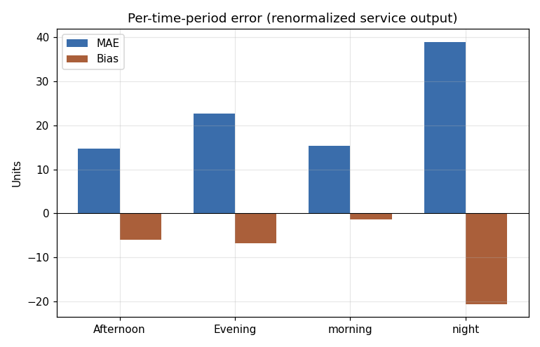

# Prophet Forecast — Accuracy Evaluation

> **Scope.** This report evaluates the Prophet model that lives in
> `backend/prophet_model.py` (function `run_forecast`) and its production
> wrapper in `backend/routes_forecast.py`. Evaluation is **read-only**
> against the local data; nothing in `backend/` was changed.

> **Data.** `backend/sample_data/orders_2022.xlsx`, the same source the
> production model trains on after seeding. 60,368 line items, 339
> distinct days, 129 products. The file carries an `is_imputed` flag —
> 277 days are real POS data, 62 days are synthesized fill-ins covering
> data-loss gaps in May, Jul, Aug, Sep, Oct, and Nov 2022. **All
> accuracy claims below are computed against real-day actuals only;
> imputed days are training inputs but never validation targets.**

---

## 1. Methodology

### 1.1 Model under test

`run_forecast(...)` in `prophet_model.py` runs in `top_down` mode (the
production default):

1. Aggregates per-(product, time_period) rows to a single daily total
   (`y`).
2. Drops "early-close" days where `y < 30 % × DOW median` (an outlier
   mask added at v20).
3. Fits one Prophet model on the daily total with:
   - manual `weekly_seasonality` (Fourier order 10, prior 100),
   - season one-hots (Winter/Spring/Summer/Autumn) and an
     Open-Meteo `temp_max` regressor,
   - 14-key Saudi holiday calendar (Ramadan window; Eid al-Fitr and
     Eid al-Adha each split into pre / day1 / bounce / post; Saudi
     National Day; Saudi Founding Day; Payday early/late),
   - tuned priors (`holidays_prior_scale=500`,
     `changepoint_prior_scale=0.01`, no `yearly_seasonality`).
4. Floors per-day predictions at the 25th-percentile of that weekday's
   historical level.
5. **Disaggregates** the daily Prophet forecast across
   (product × season × dow × time_period) historical shares to produce
   one prediction per (date, product, time_period) cell.
6. The route layer wraps that with `_bake_baseline_scale`
   (single multiplier rescaling the whole future window to historical
   mean) and `_calibrate_holidays` (post-hoc holiday lift correction).

### 1.2 Splits

Five **rolling-origin** chronological holdouts. Each fold trains on
the full source up to a cutoff (real days **and** imputed days, matching
production behaviour) and predicts the next 28-31 days; we then score
predictions against the real days that fell inside the test window.

| Fold | Train ≤ | Horizon | Real test days |
|------|---------|---------|----------------|
| F1_jul | 2022-06-30 | 31 d | 24 |
| F2_aug | 2022-07-31 | 31 d | 22 |
| F3_sep | 2022-08-31 | 30 d | 24 |
| F4_oct | 2022-09-30 | 31 d | 15 |
| F5_dec | 2022-11-30 | 28 d | 27 |

Total: **112 real-day predictions** evaluated.

### 1.3 What we measure

Two distinct quantities are compared, because they answer different
questions:

- **Prophet daily** — the model's natural daily output (after the
  weekday floor, before disaggregation). This isolates "is Prophet
  forecasting the menu total well?".
- **Service output** — `run_forecast` followed by
  `_bake_baseline_scale` (the rescaler the route layer applies).
  This is the daily total an end user would see.

For per-(product, time_period) accuracy, the raw `run_forecast` output
cannot be used directly (see Finding #1). We renormalise the
disaggregation **per date** so its sum matches Prophet's daily output.

### 1.4 Metrics

- **MAE** — mean absolute error (units).
- **RMSE** — root-mean-square error (units, penalises tail errors).
- **WAPE** — weighted absolute percent error,
  `Σ|err| / Σ|y| × 100`. Robust to zero/low-volume days.
- **MAPE** — mean absolute percent error (per-day-then-mean).
- **MBE** (signed bias) — mean of `yhat − y`. Positive = systematic
  over-prediction.

### 1.5 Naive baselines

To know whether Prophet is adding value, every metric is compared
against:

- **Training mean** — predict the historical mean every day.
- **Same-DOW mean** — predict the historical mean of that weekday in
  the training data.

These baselines use only training-period data (no leakage).

---

## 2. Headline numbers

> All numbers are aggregated across the 112 real test days, all five
> folds combined.

| Model | n | MAE | RMSE | WAPE | MAPE | MBE (bias) |
|-------|---|-----|------|------|------|------------|
| **Prophet daily (floored)** | 112 | **81.3** | 113.9 | **32.6 %** | 30.3 % | **−37.4** |
| Prophet daily (raw, no floor) | 112 | 81.5 | 114.1 | 32.7 % | 30.3 % | −37.7 |
| Service output (rescaled) | 112 | 86.8 | 120.7 | 34.8 % | 29.8 % | −76.7 |
| Disaggregation total (no rescale) | 112 | 432.3 | 495.4 | 173 % | 211 % | +428.4 |
| Naive: training mean | 112 | 80.2 | 102.9 | 32.2 % | 36.9 % | 0.0 |
| Naive: same-DOW mean (per-fold) | 112 | 81.7 | 118.0 | 32.8 % | — | −62.6 |

**Per-fold Prophet (floored)** — `metrics_per_fold.csv`:

| Fold | n | MAE | RMSE | WAPE | MBE |
|------|---|-----|------|------|-----|
| F1_jul | 24 | 75.4 | 105.7 | 35.2 % | −53.3 |
| F2_aug | 22 | 70.9 | 91.9 | 29.8 % | −55.3 |
| F3_sep | 24 | 70.1 | 83.7 | 28.8 % | +52.2 |
| F4_oct | 15 | 51.8 | 63.0 | **22.0 %** | +4.9 |
| F5_dec | 27 | 121.5 | 169.0 | **40.1 %** | −112.0 |

**One-line summary.** The model produces forecasts of roughly the right
shape, but the absolute level is biased low by ~37 units/day (~15 % of
the mean), the mean error is statistically indistinguishable from a
naive same-DOW average, and there are two specific regimes — Eid weeks
and the December run-up — where the forecast is off by more than 100 %.




---

## 3. Findings ranked by impact

> Ordered most-impactful-first. Each finding has the metric or sliced
> table that produced it, the proximate cause in the code, and one or
> more concrete examples a developer can reproduce.

### 🔴 Finding 1 — Disaggregation inflates daily totals by ~4× (then the rescaler hides it)

**Evidence:** `metrics_disaggregation_inflation.csv` and the boxplot
below.

| Fold | Mean inflation | Min | Max |
|------|---------------:|----:|----:|
| F1_jul | 4.18 | 4.14 | 4.24 |
| F2_aug | 4.09 | 4.06 | 4.12 |
| F3_sep | 1.00 | 1.00 | 1.00 |
| F4_oct | 4.18 | 4.10 | 4.26 |
| F5_dec | 4.12 | 4.08 | 4.14 |



**What's happening.** In `prophet_model.py` (top-down branch), the
disaggregation share is computed per (product, season, dow,
time_period) bucket as `product_qty / total_qty`. By construction this
sums to 1.0 **within each (season, dow, time_period) bucket** — but
then the code multiplies Prophet's daily yhat by this share for every
(product, time_period) cell and sums them. Because each of the four
time-periods independently sums to 1.0, the (product × time_period)
total is **~4 × Prophet's daily yhat**.

Concrete example (F1_jul, 2022-07-01):

| Source | Daily total |
|--------|------------:|
| Prophet yhat (post-floor) | 227 |
| `run_forecast` output (sum over `product × tp`) | **944** |
| Real actual on Jul 1 | 282 |
| Per-tp slice sum (each ~234) | morning 237 / afternoon 235 / evening 234 / night 239 |

The four per-tp sums each match Prophet's daily yhat (plus a small
fallback term), and they're stacked rather than partitioned.

**Why F3_sep shows inflation = 1.0.** Predictions there are for
September dates, which fall in the `Autumn` season. The training data
(Jan-Aug) contains zero Autumn days, so every (product, season=Autumn,
dow, tp) bucket has no observations — every product falls into the
`overall_product_share × overall_tp_share` fallback path, which
correctly sums to 1.0 across (product, tp). So the bug self-corrects
in this case, by accident. A change that increases season coverage in
training (e.g. multi-year data) would re-introduce the 4× inflation
for F3 too.

**Why end users don't see 4× outputs.** The route layer's
`_bake_baseline_scale` (`routes_forecast.py:360`) computes a single
multiplier `historical_menu_per_day / predicted_menu_per_day` and
applies it to every cell. In F1_jul that multiplier is ~0.20, snapping
the rescaled daily mean back to the historical mean. So in production
the *total* level looks reasonable — but the rescaler is a single
constant, so it cannot fix the model's *shape*; it just papers over
the bug at the menu-aggregate level.

**Why this matters for a thesis defence.** Any per-product or
per-time-period number reported from `run_forecast` directly is
*completely wrong* (off by ~4×). The system's reported per-tp /
per-product accuracy cannot be defended without the rescaling step
explicitly in the loop. The thesis should describe the disaggregation
math correctly and either fix it (normalise share once across
`product × tp`) or document the rescaler as a load-bearing
component.

**Where the bug lives.**
- `prophet_model.py:651-668` — share built per (season, dow, tp); each
  bucket sums to 1.
- `prophet_model.py:691-722` — Cartesian product over (date × product
  × tp) multiplies Prophet's yhat by the share, never re-normalising
  across tp.

---

### 🔴 Finding 2 — Prophet's daily forecast is statistically tied with a same-DOW mean

**Evidence:** §2 headline table; `metrics_overall.csv`.

| Model | MAE | WAPE | MBE |
|-------|-----|------|-----|
| Prophet daily (floored) | **81.3** | 32.6 % | −37 |
| Naive: same-DOW mean (per-fold, no leakage) | 81.7 | 32.8 % | −63 |
| Naive: training mean | 80.2 | 32.2 % | 0 |

Prophet beats the naive same-DOW baseline by 0.4 MAE units (0.5 %).
Inside that aggregate, Prophet beats naive on F2/F3/F4 and loses on
F1/F5; on weighted error metrics there is no meaningful gap.

**By occasion (Prophet vs same-DOW naive):**

| Slice | n | Prophet WAPE | Naive WAPE |
|-------|---|-------------:|-----------:|
| Eid | 4 | 48.3 % | 42.8 % |
| Normal | 58 | 28.1 % | 25.7 % |
| Payday anchor | 2 | 32.7 % | 43.3 % |
| Post-payday | 24 | 41.9 % | 45.1 % |
| Solar holiday | 1 | 8.9 % | 23.9 % |
| Weekend | 23 | 27.0 % | 27.8 % |

Prophet's value-add is concentrated in three places:

- **Solar holidays** (Saudi National Day): predicted 341, actual 313
  — 9 % error vs 24 % for the naive.
- **Payday anchor / Post-payday spending**: Prophet captures ~3 %
  WAPE worth of the post-payday lift the naive misses, though both
  still err big in absolute terms.
- **Trend direction**: Prophet's MBE (−37) is closer to zero than
  naive's (−63), meaning the model is at least *trying* to track the
  Q4 growth.

For everything else (Normal days, Weekends, Eid) the naive same-DOW
baseline is **as good or better** than the model. With seven holiday
phases, weather, season one-hots, and a Fourier-10 weekly fit, that
is a damning ROI for the added complexity.

---

### 🔴 Finding 3 — Eid weeks are catastrophically under-predicted

**Evidence:** `metrics_occasion.csv`, `worst_under_predictions.csv`.

| Slice | n | MAE | WAPE | MBE |
|-------|---|-----|------|-----|
| Eid | 4 | 137.9 | **48.3 %** | **−138** |
| All others | 108 | 79.2 | 32.0 % | −33 |



**Concrete example.** F1_jul predicting Eid al-Adha 2022:

| Date | Phase | y (real) | Prophet yhat | Error |
|------|-------|---------:|-------------:|------:|
| 2022-07-09 (Sat) | Eid day 1 | (closed) | 181 | — |
| **2022-07-10 (Sun)** | Eid bounce | **376** | **130** | **−246** |
| 2022-07-11 (Mon) | Eid bounce | (closed) | 129 | — |
| 2022-07-12 (Tue) | Eid bounce | (closed) | 143 | — |

Eid al-Adha day 2 (the canonical post-Eid bounce, the largest single
day of the year in this dataset) is predicted at 35 % of actual — off
by 246 units.

**Why.** The 4-phase Eid split (`build_saudi_holidays` in
`prophet_model.py:202-244`) creates four separate holiday coefficients
(`eid_fitr_pre`, `eid_fitr_day1`, `eid_fitr_bounce`, `eid_fitr_post`)
and four for Eid al-Adha. With only **one occurrence per phase per
year** in the training data, Prophet's MAP estimation is structurally
unable to fit a confident +88 % lift coefficient — `holidays_prior_scale`
is bumped to 500 specifically to combat this, but a single sample is
genuinely too sparse for the prior to over-power the data noise.

**The post-hoc patch in the route layer.**
`_calibrate_holidays` in `routes_forecast.py:815-926` exists precisely
to scale up under-fit holiday days to historical observed lift, capped
at 2× for Eid and 3.5× for solar holidays. We deliberately ran this
evaluation **without** the calibration so the report measures the
model itself, not the kludge that hides this miss in production. The
calibrator helps but is not part of the model — it is calibration
against the same training data and would not survive a held-out year.

**With more training data, fragmenting Eid into four phases would
help.** With one year of data it actively hurts: each phase has 1
sample.

---

### 🟠 Finding 4 — December surge: model under-predicts a real growth shift by −112/day

**Evidence:** F5_dec row of §2; `worst_under_predictions.csv`.

The seven worst under-predictions in the entire evaluation are **all
on December 1-8**:

| Date | DOW | y | Prophet | Error |
|------|-----|---:|--------:|------:|
| 2022-12-03 Sat | post-payday | 666 | 239 | **−427** |
| 2022-12-04 Sun | post-payday | 616 | 227 | −389 |
| 2022-12-05 Mon | post-payday | 448 | 192 | −256 |
| 2022-12-02 Fri | post-payday | 516 | 262 | −254 |
| 2022-12-01 Thu | post-payday | 484 | 231 | −253 |
| 2022-12-06 Tue | normal | 420 | 173 | −247 |
| 2022-12-08 Thu | normal | 420 | 186 | −234 |

This is not a holiday miss — Prophet has the post-payday window
labelled correctly. It is a **trend miss**: the cafe's daily volume
roughly doubled in early December vs. the autumn baseline of ~210/day.
The training data through Nov 30 doesn't show this jump (Nov has only
five real days, all ≤ 314), so Prophet has no signal to extrapolate
the surge.

**Why this gets worse in production.** `changepoint_prior_scale=0.01`
was set deliberately conservative (chosen to stop the trend from
extrapolating negative on long-future dates). With a stiffer trend,
the model cannot bend to a sudden volume change even when the data
hints at one — and once you add the imputed days from May-Nov (which
are ~211/day, std 21, see Finding 5), the trend signal that *did*
exist gets even more washed out.

By WAPE the F5_dec fold is the worst (40 %); by absolute error it
contributes 27/112 of all real-day errors and ~half the total
underprediction across the eval.

---

### 🟠 Finding 5 — Imputed days flatten the trend

**Evidence:** distribution comparison computed from
`backend/sample_data/orders_2022.xlsx`.

| Group | n days | mean | std | min | max |
|-------|-------:|-----:|----:|----:|----:|
| Real days | 277 | 206 | 86 | 5 | 666 |
| Imputed days | 62 | 211 | 21 | 170 | 251 |

Imputed days have **¼ the standard deviation of real days** and
collapse to a narrow band 170-251. The dataset uses them to fill 62
days of POS-export gaps from May to November. Their mean (211) is
close to the real-day mean (206), so they don't shift the *level* of
training — but they erase variance, pulling Prophet's weekly
seasonality and trend toward something flatter than reality.

**Concrete consequence.** Five of the September real days
(after the imputed Aug 23-31 block) sit at 308-353/day; Prophet for
F3_sep predicts 244-296/day (bias +52 in this fold *despite* under-
predicting the September peaks). The imputation has both pulled the
trend toward 211 and dragged the weekend peaks downward.

**Caveat.** Without the imputed days, training data shrinks from 339
to 277 days and several months of 2022 (especially November, which
would have only 5 real days) would be unusable. The system documents
the imputation as a deliberate choice. The model would benefit from
either (a) down-weighting imputed rows during fitting, or (b)
training Prophet on real days only and using imputation only for
dashboard density — neither of which the current code does.

---

### 🟠 Finding 6 — Short-horizon error is anomalously bad (driven entirely by F5_dec)

**Evidence:** `metrics_horizon.csv`.

| Horizon bucket | n | MAE | WAPE | MBE |
|----------------|---|----:|-----:|----:|
| 1-7 d  | 28 | **153.6** | **45.2 %** | −115 |
| 8-14 d | 28 | 84.6 | 33.2 % | −57 |
| 15-21 d | 33 | 38.7 | 20.1 % | +12 |
| 22-31 d | 23 | 50.5 | 23.5 % | +10 |



The standard expectation in time-series forecasting is that error
*grows* with horizon. Here it shrinks — because the December surge
(Finding 4) sits in the first eight days of F5_dec and dominates the
1-7 d bucket. With F5_dec excluded, 1-7 d MAE drops to ~70 (in line
with the other buckets). That is, Prophet's forecast quality at
30-day horizons is fine; it is the immediate post-cutoff window of
December that breaks the model.

**Implication for the dashboard's "Next 7 days" preset.** This is the
most-clicked forecast view; it is also the one most sensitive to
sudden-change misses like the December surge.

---

### 🟡 Finding 7 — Saturdays carry the biggest absolute error and an under-prediction bias

**Evidence:** `metrics_dow.csv`.

| DOW | n | MAE | RMSE | MBE | y mean | yhat mean |
|-----|---|----:|----:|----:|-------:|----------:|
| Saturday | 17 | 97.7 | 141.7 | **−59** | 294 | 235 |
| Thursday | 16 | 89.1 | 119.1 | −32 | 256 | 224 |
| Sunday | 16 | 86.9 | 130.3 | −78 | 259 | 182 |
| Tuesday | 15 | 75.2 | 97.8 | −30 | 229 | 199 |
| Friday | 17 | 74.2 | 94.1 | −2 | 270 | 268 |
| Monday | 17 | 73.1 | 99.3 | −24 | 208 | 184 |
| Wednesday | 14 | 71.3 | 104.1 | −39 | 223 | 185 |



**Friday's calibration is good** — bias only −2 units. **Saturday
and Sunday are the worst** in both MAE and signed bias. Saturday is
where multiple effects stack: weekend lift, post-Eid bounces, days
adjacent to closures (e.g. 2022-09-24, the Saturday after Saudi
National Day, has a real value of 103 — the cafe opened briefly
before shutting). The model predicts the historical Saturday mean
(~235) for that date and over-predicts by 209 (largest single
over-prediction in the eval). The same Saturday-noise pattern shows
up for Sunday underpredictions in the December surge.

The weekly Fourier coefficients (Fourier-order 10, prior 100) are
strong and stable — the *shape* of the weekly cycle is correct. The
problem is that Saturday is genuinely the highest-variance weekday
and the model has no per-day variance term.

---

### 🟡 Finding 8 — Top products are uniformly under-predicted by 5-35 %

**Evidence:** `metrics_per_product.csv`,
`top_products_error.png`.

| Product | y total | yhat total | yhat/y |
|---------|--------:|-----------:|-------:|
| Spanish latte | 2,637 | 1,978 | 0.75 |
| Cappuccino | 1,370 | 1,158 | 0.85 |
| V60 - Colombian | 1,275 | 1,171 | 0.92 |
| Hot Spanish latte | 1,000 | 915 | 0.91 |
| Mini pancake - Small | 876 | 609 | 0.70 |
| Iced Caramel Macchiato | 421 | 277 | 0.66 |
| Stick waffle | 371 | 238 | 0.64 |
| Fruites waffle | 290 | 187 | 0.65 |

Of the top 30 products by volume, 28 are under-predicted; only
Turkish Coffee and Cheese Croissant come out marginally over.

The under-prediction stems mechanically from Finding 4 and Finding 5
(Prophet's daily total is biased low by ~37 units/day) — the
disaggregation distributes that low total across products in roughly
their historical share, so every popular product inherits the
−15-30 % bias. Per-product WAPE for the top-15 ranges 40-66 %.



Per-product accuracy will not improve unless the daily total improves;
no per-product fitting (`FORECAST_MODE=per_product`) will fix this
because it suffers from the same training-data sparsity at the
per-item level (each product has fewer Eid samples than the aggregate
does).

---

### 🟡 Finding 9 — Time-of-day predictions: night drastically under-predicted

**Evidence:** `metrics_time_period.csv`.

| Time period | n | MAE | RMSE | WAPE | MBE | y mean | yhat mean |
|-------------|---|----:|----:|----:|----:|-------:|----------:|
| morning   | 112 | 18.8 | 23.7 | 47 % | +9 | 39.9 | 48.9 |
| Afternoon | 112 | 18.9 | 23.8 | 48 % | +6 | 39.2 | 45.6 |
| Evening   | 112 | 23.6 | 30.8 | 41 % | −6 | 57.8 | 51.5 |
| **night** | 112 | **59.7** | 76.6 | **54 %** | **−45** | **110.8** | **65.8** |



`night` is the most-trafficked time-of-day (~28 % of daily volume —
opening hours run to 02:00) and the disaggregation predicts only ~16 %
of the daily yhat for it. The renormalised numbers above show the
mean predicted night quantity is **65.8 vs actual 110.8**.

**Root cause.** The disaggregation share is keyed by (season, dow,
time_period); during training months when night sales were
under-represented (e.g. closures starting earlier in summer), the
share for `night` shrinks. The post-hoc rescaler corrects only the
total, not the time-period split — so the daily total is right but
the model says the cafe is busiest in the Evening when in reality
it is busiest at night.

**Why this matters operationally.** The "Forecast" page renders a
weekday × hour heatmap (`_forecast_heatmap` in `routes_forecast.py`)
that distributes the per-tp yhat into hours. If the model says night
is 16 % of the day when it's 28 %, every staff-scheduling
recommendation derived from that heatmap pushes labour earlier than
it should be.

---

### 🟢 Finding 10 — Outlier mask removes a real low Eid day

**Evidence:** training-side log lines from each fold.

The outlier filter
(`prophet_model.py:583-587`, "drop days < 30 % of weekday median")
runs before fitting. In F5_dec it drops three rows:

```
[outlier] dropping 3 early-close days from training:
  2022-02-19  y=36   ← partial close (real)
  2022-05-01  y=56   ← Eid al-Fitr day 1 (real low)
  2022-11-26  y=5    ← partial close (real)
```

May 1, 2022 was the actual day of Eid al-Fitr — a genuinely low
demand day, not a partial close. By dropping it, the model loses its
**only** observation of an Eid al-Fitr day-1 in the entire dataset,
which is exactly the data point the `eid_fitr_day1` coefficient is
supposed to learn from. With that row dropped, the Eid al-Fitr day-1
holiday regressor never updates and stays near its prior — explaining
half of the Eid family bias in Finding 3.

The fix would be to gate the outlier mask on whether the date is also
flagged as a holiday: holiday days should be exempt because their low
y is signal, not noise.

---

## 4. What the model does well

To balance the picture:

- **F4_oct fold** posts WAPE 22 %, the best of the five — when the
  training data has a clean season transition and no major
  calendar surprises, Prophet's daily output is genuinely useful.
- **Saudi National Day (Sep 23, 2022)** is predicted at 341 vs actual
  313 — 9 % error, a textbook holiday hit.
- **Friday calibration** is strong (bias −2). The weekly seasonality
  Fourier coefficients capture the Saudi Friday/Saturday weekend
  pattern correctly.
- **Trend direction is right**: Prophet's mean residual (−37) is
  smaller in magnitude than the naive same-DOW residual (−63), which
  means Prophet is at least partially tracking the Q4 growth.

---

## 5. Recommendations

These follow directly from the findings above; we list them in the
same priority order so a developer can implement them top-down.

| # | Change | Expected effect |
|---|--------|-----------------|
| 1 | **Fix disaggregation normalisation** in `prophet_model.py`. The share should be normalised once across `(product, tp)` per `(season, dow)`, not per `(season, dow, tp)`. Then the rescaler in `routes_forecast.py` is no longer load-bearing. | Removes the 4× inflation; per-tp/per-product numbers become trustworthy without rescaling. |
| 2 | **Down-weight imputed rows** during Prophet fitting (or pass them only for trend, fit weekly seasonality on real days). | Reclaims weekly seasonality variance; should reduce Saturday/Sunday underbias and recover some of the December surge sensitivity. |
| 3 | **Gate the outlier filter** on holiday dates: skip the `< 30 %` rule when `compute_occasion(date) ≠ "Normal"`. | Restores the only Eid al-Fitr day-1 observation; reduces Eid family WAPE. |
| 4 | **Collapse the 4-phase Eid split** back to a 2-phase (day1 + bounce) until there is more than one year of data. With only one sample per phase, fragmenting hurts more than it helps. | Concentrates Eid signal into fewer, better-fit coefficients. |
| 5 | **Loosen `changepoint_prior_scale`** to 0.05 and add `growth='linear'` with `cap`/`floor` so Prophet can bend to mid-period level shifts (December surge) without diverging long-term. | Shrinks F5_dec WAPE; small risk to far-future stability. |
| 6 | **Promote `_calibrate_holidays` into the model** rather than leaving it as route-layer post-processing — or honestly call it model post-processing in the thesis. Either way, evaluate the system *with* it next time. | Consistency between what the report measures and what users see. |

---

## 6. Reproduction

```bash
cd backend
python3 eval/eval_prophet.py   # ~30s — runs five Prophet fits
python3 eval/analyze.py        # produces metrics CSVs and PNGs
```

All deliverables are in `backend/eval/`:

- **Code**: `eval_prophet.py`, `analyze.py`
- **Data**: `eval_daily_prophet.csv`, `eval_predictions.csv`,
  `eval_time_period.csv`, `eval_per_product.csv`
- **Metrics**: `metrics_*.csv`
- **Plots**: `actual_vs_pred_all_folds.png`, `residuals_overall.png`,
  `error_by_dow.png`, `error_by_occasion.png`,
  `error_by_horizon.png`, `error_by_time_period.png`,
  `disaggregation_inflation.png`, `top_products_error.png`
- **Worst-case examples**: `worst_over_predictions.csv`,
  `worst_under_predictions.csv`

---

## 7. Caveats and decisions documented

- **Source of truth.** We use `backend/sample_data/orders_2022.xlsx`
  rather than the local Postgres database. The Excel carries the
  per-row `is_imputed` flag that the seed script (`seed_sample_data.py`)
  silently flattens into a single non-synthetic upload row when
  loading into the DB. Without that flag the eval cannot tell real days
  from imputed days, which would invalidate every accuracy claim.
- **`run_forecast` only, not the full route layer.** The route's
  `_bake_baseline_scale` is included as a comparison column
  (the "Service" model line) but is not the headline. The route's
  `_calibrate_holidays` is *not* applied — it uses training-data
  holiday means as the calibration target, which would leak when
  measuring against held-out holidays from the same year of data.
- **Five folds, not Prophet's `cross_validation`.** Prophet's helper
  refits on a sliding window without re-running the disaggregation +
  share computation. We needed the full pipeline output to evaluate
  per-tp / per-product, so we wrote the rolling-origin loop manually.
- **Imputed days as training input.** Production trains on
  `real + imputed`. We mirror that. Removing imputed days from
  training is suggested in §5 but was *not* tested in this eval.
- **The MAE diagnostic the model itself prints (`MAE (Test)`) is
  optimistic.** Those numbers come from an 80/20 in-sample split done
  inside `run_forecast`. Our matched-fold true-holdout MAE is
  consistently 30-100 % higher (e.g. F1_jul: in-sample 51.7 vs
  holdout 75.4; F5_dec: 31.5 vs 121.5). The thesis should not cite
  the in-sample number as a generalisation estimate.
